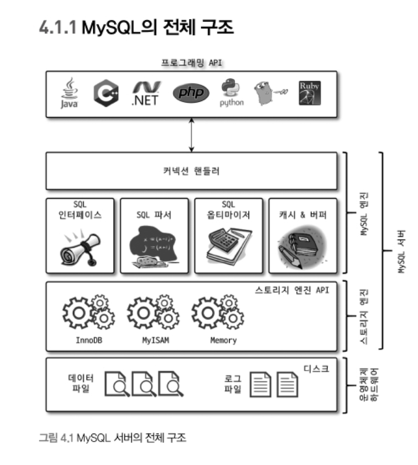
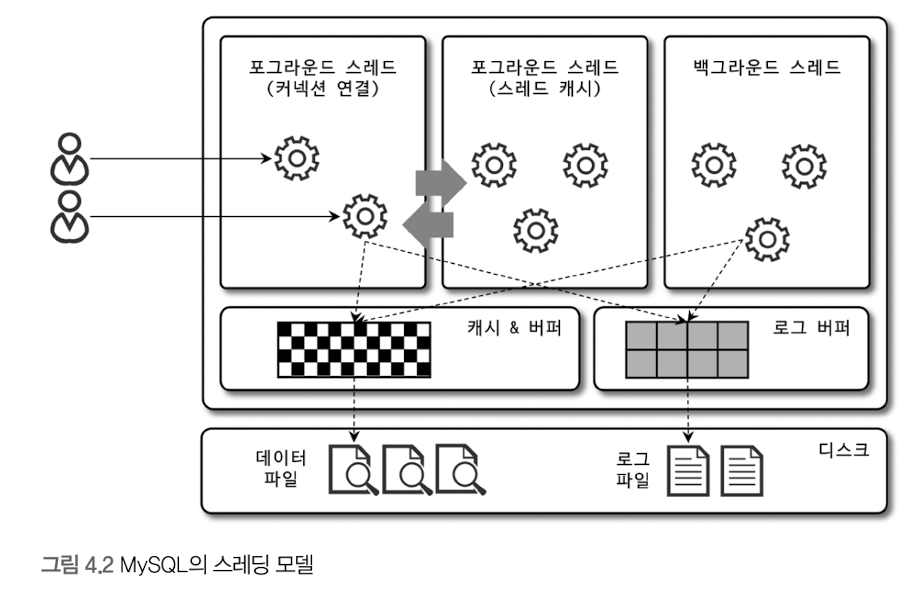
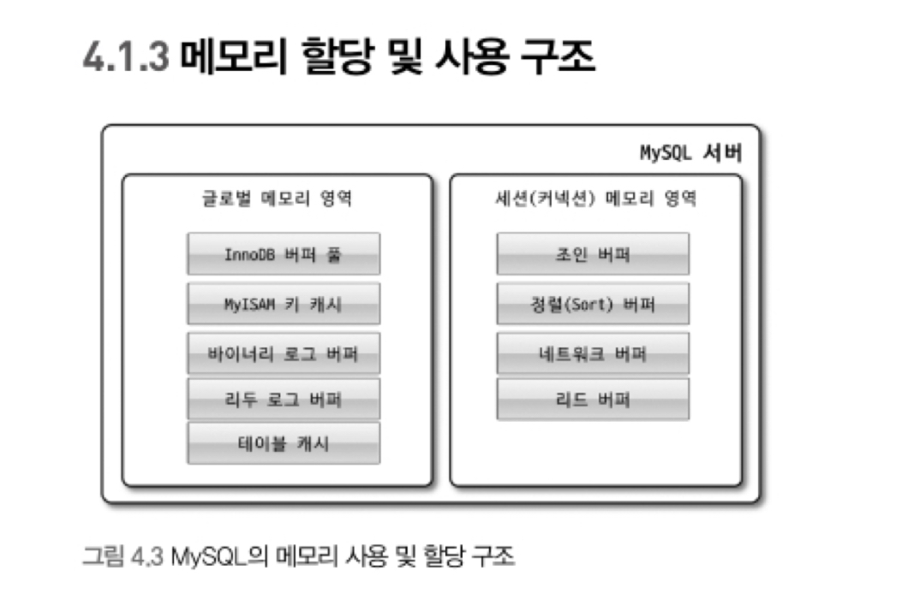

MySQL서버는 <b style="color=red;">MySQL 엔진</b>과 <b style="color=red;">스토리지 엔진</b>으로 구분된다.

# MySQL 엔진 아키텍처

### MySQL엔진
MySQL 엔진은 클라이언트로부터의 접속 및 쿼리 요청을 처리하는 <b style="color=red">커넥션 핸들러</b>와 <b style="color=red">SQL Parser 및 전처리기</b>, 쿼리에 최적화된 실행을 위한 <b style="color=red">옵티마이저</b>가 중심을 이룬다.

또한 MySQL은 표준 SQL(ANSI SQL)문법을 지원하기 때문에 표준 문법에 따라 작성된 쿼리는 타 DBMS와 호환된다.

### 스토리지 엔진
실제 데이터를 디스크 스토리지에 저장하거나 디스크 스토리지로부터 데이터를 읽어오는 부분은 스토리지 엔진이 담당한다.

MySQL 서버에서 MySQL 엔진은 하나지만 스토리지 엔진은 여러 개를 동시에 사용할 수 있다. 테이블이 사용할 스토리지 엔진은 다음과 같이 지정할 수 있으며, 지정한 이후에는 해당 테이블의 모든 읽기 작업이나 변경 작업은 정의된 스토리지 엔진이 처리한다.

> InnoDB 스토리지 엔진을 사용하도록 정의하는 방법

    mysql> CREATE TABLE test_table (fd1 INT, fd2 INT) ENGINE=INNODB;

### 핸들러 API
MySQL엔진의 <b style="color=red">쿼리 실행기</b>에서 데이터를 쓰거나 읽어야할 때는 각 스토리지 엔진에 쓰기 또는 읽기를 요청하는데, 이러한 요청을 핸들러 요청이라고 하며, 여기서 사용되는 API를 <b style="color=red">핸들러 API</b>라고 한다.

핸들러 API를 통해 얼마나 많은 데이터 작업이 있었는지는 `SHOW GLOBAL STATUS LIKE 'Handler%';` 명령으로 확인할 수 있다.

## MySQL 스레딩 구조

<b style="color=green">MySQL 서버는 프로세스 기반이 아니라 스레드 기반으로 동작</b>하며, 크게 포그라운드 스레드와 백그라운드 스레드로 구분할 수 있다.

> MySQL서버에서 실행중인 스레드 목록은 <b>performance_schema</b> 데이터베이스의 <b>threads</b> 테이블을 통해 확인할 수 있다.

    mysql> SELECT thread_id, name, type, processlist_user, processlist_host FROM performance_schema.threads ORDER BY type, thread_id;

사용자의 요청을 처리하는 포그라운드 스레드는 `thread/sql/one_connection` 스레드이다.

### 포그라운드 스레드(클라이언트 스레드)
<b style="color=green">포그라운드 스레드는 최소한 MySQL 서버에 접속된 클라이언트의 수만큼 존재</b>하며, 주로 각 클라이언트 사용자가 요청하는 쿼리 문장을 처리한다.

클라이언트가 작업을 마치고 커넥션을 종료하면 해당 커넥션을 담당하던 스레드는 다시 <b style="color=red">스레드 캐시</b>로 되돌아간다. 이때 이미 스레드 캐시에 일정 개수 이상의 대기 중인 스레드가 있으면 스레드 캐시에 넣지 않고 스레드를 종료시킨다.

> 스레드 캐시에 유지할 수 있는 최대 스레드 개수는 `thread_cache_size` 시스템 변수로 설정 가능하다.

<b style="color=red">그럼 스레드 캐시의 크기는 어느 정도가 적당한가?</b>

https://www.navisite.com/blog/mysql-optimization-tip-thread-cache-size/ 에 따르면 `The more connections you allow the more overhead you bring to your server. Use your connections efficiently.` 라고 한다. 즉, 포그라운드 스레드의 개수가 증가하여 커넥션 수를 늘릴수록 오버헤드가 증가한다는 것이다. 또, 캐시에 잉여 스레드가 존재하면 이는 메모리 사용량을 잡아먹는 범인이 될 것이기 때문에 적절한 개수를 유지하는 것이 좋아보인다.

<b style="color=red">그래서 몇 개?</b>

MySQL 공식문서에 따르면 스레드 캐시의 크기는 $8 + (max_connections / 100)$ 를 따른다고 한다. 

https://dev.mysql.com/doc/refman/8.0/en/server-system-variables.html#sysvar_thread_cache_size

다시 돌아와서, 포그라운드 스레드는 데이터를 MySQL의 데이터 버퍼나 캐시로부터 가져오며, 버퍼나 캐시에 없는 경우에는 직접 디스크의 데이터나 인덱스 파일로부터 데이터를 읽어와서 작업을 처리한다.

MyISAM 테이블은 디스크 쓰기 작업까지 포그라운드 스레드가 처리하지만 InnoDB 테이블은 데이터 버퍼나 캐시까지만 포그라운드 스레드가 처리하고, 나머지 버퍼로부터 디스크까지 기록하는 작업은 백그라운드 스레드가 처리한다.

### 백그라운드 스레드
InnoDB는 여러 가지 작업이 백그라운드로 처리된다.

1. 인서트 버퍼(Insert Buffer)를 병합하는 스레드
    - 인덱스 키에 대한 삽입 작업을 최적화하기 위해 설계됨.
    - 인덱스에 새로운 키를 삽입할 때마다 해당 키가 B-Tree 인덱스 구조에 재배치 되어야하는데, 이는 성능에 영향을 줄 수 있다. 그래서 새로운 키가 들어오면 인서트 버퍼에 임시로 저장했다가 주기적으로 실제 B-Tree 구조에 병합된다.

2. 로그를 디스크로 기록하는 스레드
3. InnoDB 버퍼 풀의 데이터를 디스크에 기록하는 스레드
4. 데이터를 버퍼로 읽어 오는 스레드
5. 잠금이나 데드락을 모니터링하는 스레드

위 역할 중 디스크에 데이터를 기록하는 Write Thread의 경우 아주 많은 작업을 백그라운드로 처리하기 때문에 일반적인 내장 디스크를 사용할 때는 2~4개 정도 설정하고, DAS나 SAN과 같은 스토리지를 사용할 때는 디스크를 최적으로 사용할 수 있을 만큼 스레드의 개수를 충분하게 설정해야 한다.

또, 사용자의 요청을 처리하는 도중 데이터의 쓰기 작업은 버퍼링되어 처리되어도 되지만 데이터의 읽기 작업은 절대 지연되면 안 된다. InnoDB는 쓰기 작업을 버퍼링해서 일괄 처리하는 기능을 탑재한다. 그래서 InnoDB에서는 INSERT, UPDATE, DELETE 쿼리로 데이터가 변경되는 경우 데이터가 디스크의 데이터 파일로 완전히 저장될 때까지 기다리지 않아도 된다. 하지만 MyISAM의 경우 사용자 스레드가 쓰기 작업까지 함께 처리하도록 설계되어 있어 버퍼링이 되지 않는다.

## 메모리 할당 및 사용 구조

MySQL에서 사용되는 메모리 공간은 크게 <b style="color=red">글로벌 메모리 영역</b>과 <b style="color=red">로컬 메모리 영역</b>으로 구분할 수 있다.

### 글로벌 메모리 영역
글로벌 메모리 영역의 모든 메모리 공간은 MySQL 서버가 시작되면서 운영체제로부터 할당된다.

일반적으로 클라이언트 스레드의 수와 무관하게 하나의 메모리 공간만 할당된다. 필요에 따라 2개 이상의 메모리 공간을 할당받을 수도 있지만 클라이언트의 스레드 수와는 무관하며, 메모리 영역은 모든 스레드에 의해 공유된다.

- 테이블 캐시
- InnoDB 버퍼 풀
- InnoDB 어댑티브 해시 인덱스
- InnoDB 리두 로그 버퍼

### 로컬 메모리 영역
세션 메모리 영역이라고도 표현하며, MySQL 서버상에 존재하는 클라이언트 스레드가 쿼리를 처리하는 데 사용하는 메모리 영역이다.

클라이언트가 MySQL 서버에 접속하면 MySQL 서버는 클라이언트 커넥션으로부터의 요청을 처리하기 위해 스레드를 하나씩 할당하게 되는데, 이 클라이언트 스레드가 사용하는 메모리 공간이다.

<b style="color=red">로컬 메모리는 각 클라이언트 스레드별로 독립적으로 할당</b>되며 절대 공유되어 사용되지 않는다.

로컬 메모리 공간은 각 쿼리의 용도별로 필요할 때만 공간이 할당되고 필요하지 않은 경우에는 MySQL이 메모리 공간을 할당하지 않을 수도 있다(소트 버퍼, 조인 버퍼). 또, 커넥션이 열려 있는 동안 계속 할당된 상태로 남아 있는 공간(커넥션 버퍼, 결과 버퍼)도 있고, 쿼리를 실행하는 순간에만 할당했다가 다시 해제하는 공간(소트 버퍼나 조인 버퍼)도 있다.

